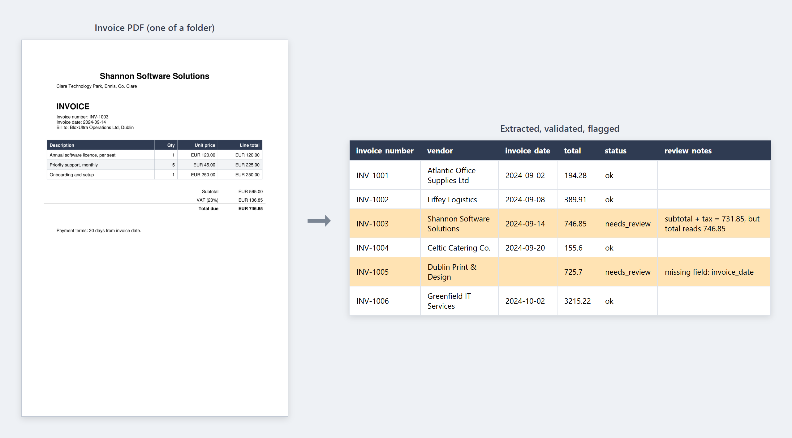

# Invoice OCR Extractor

Point it at a folder of invoice PDFs. It reads each one with a vision
model, pulls out the vendor, dates, line items and totals as structured
data, checks the numbers actually add up, and writes one tidy
spreadsheet - with anything that looks wrong flagged for a human.



## Why I built this

Typing invoices into a spreadsheet by hand is slow, dull, and easy to
get wrong, and plenty of finance teams still do exactly that. I wanted
to see how much of it could be automated, and - more importantly - how
to do it in a way you could actually trust with real numbers.

The honest answer is that you don't fully trust the model. So this is
really two things: an extractor, and a validator that checks the
extractor's work. The second part is the one that matters.

## How it works

- `generate_invoices.py` - creates 6 synthetic invoice PDFs to test with
- `extractor.py` - renders each PDF page to an image, sends it to a
  vision model, and parses the reply into structured JSON
- `validator.py` - checks the extracted numbers against each other
- `main.py` - runs the whole folder and writes the spreadsheet

The model is reached through OpenRouter, which is an OpenAI-compatible
gateway, using a Gemini vision model. Because of that, switching to a
different model is a one-line change.

### The validation layer

This is the part I'd want to talk through. Every invoice has internal
arithmetic that has to hold, so the validator re-checks it:

- for each line, `quantity x unit_price` should equal the line total
- the line totals should add up to the subtotal
- `subtotal + tax` should equal the total

If any of that doesn't tie out, or if the model returned `null` for a
field it couldn't read, the invoice is marked `needs_review` and gets a
note saying exactly what to check. In the screenshot above, INV-1003's
total is wrong and INV-1005 is missing its date - both got caught.

A few decisions behind that:

- **The model is told to return `null`, not to guess.** A guessed value
  looks just as confident as a correct one. A `null` can at least be
  flagged.
- **The prompt asks for a fixed schema, not a fixed layout.** It doesn't
  assume where anything sits on the page, so an invoice in a format it
  hasn't seen before still extracts into the same shape - and anything
  missing just becomes a flag.
- **A bad extraction is a result, not a crash.** If a PDF fails or the
  model returns broken JSON, that invoice is recorded as failed and the
  batch carries on.

## Running it

You need an OpenRouter API key (free to create at
[openrouter.ai/keys](https://openrouter.ai/keys)).

```bash
pip install -r requirements.txt
cp .env.example .env          # then paste your key into .env
python main.py                # processes the invoices/ folder
```

The sample invoices are already in `invoices/`. To regenerate them, or
make more, run `python generate_invoices.py`.

## What I learned

The model was the easy part. It reads these invoices correctly almost
every time, and it would be tempting to just trust it and move on. The
real work was deciding what happens when it doesn't - because a
spreadsheet full of wrong numbers, presented confidently, is worse than
no spreadsheet at all. Building the validator is what turned this from a
demo into something I'd actually let near real data.

## A note on the data

The invoices are synthetic, generated by `generate_invoices.py`. Nothing
in this repo is a real financial document. The `.env` file with the API
key is git-ignored and never committed.
